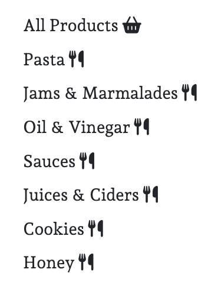
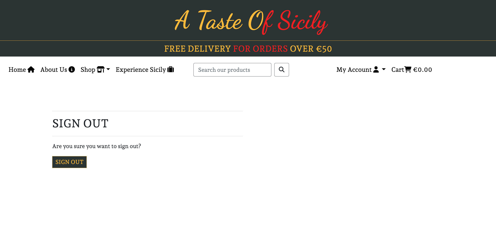

# **A Taste Of Sicily**

## **1. About** 

A preview of the site on different screens:

View the live project here: https://a-taste-of-sicily.herokuapp.com/.

A Taste Of Sicily is the online shop for a Sicilian company of the same name, currently offering the possibility to purchase gourmet products from the same producer and soon growing to include tasting and visit experiences in Sicily. 

## **2. General User Goals** 

### **2.1 Site Owners' Goals**
The persona I have thought of/created for this project is Domenico Montalbano, a fictional farmer and the current president of the company. He understands that in the digital age we live in it is impossibile to thrive as a business unless one has an established presence online. He envisions the company's website as a key channel to promote his company and products, as well as to promote Sicily, the region where he was born and which he desires other people to appreciate as he himself does.

### **2.2. User Goals**
* General users:
Italian food is generally appreciated by many people abroad. For this reason, the first category of site users is made up of Italian food buffs who surf the Internet to discover new products. 
* Returning users:
The second category of users is made up of the people that have already made a purchase on the website. Having found the products to be of great quality, they come back to the website to purchase the items they liked or try new ones.

## **3. Wireframes & Database, User Stories & Agile Development**

A detailed report regarding user stories and agile development can be found here: [Wireframes & Database, User Stories & Agile Development](docs/Agile.md).

## **4. Features**

* Homepage

The homepage concisely informs users of what the website is and what to expect from it.

* Site logo & Navigation Bar

* Shop - Dropdown (Product Categories)

* Navbar, Account Section - General user

* Navbar, Account Section - Authenticated user + superuser

* Jumbotron/Shop Now Button

* Footer & Newsletter Sign-up Form

* About Us Page

* Products - Main Page

* Products - Individual Category Page

* Product Details Page

* Experiences - Main Page

* Experience Details Page

* Profile & Order History

* Add Food Item - Form (A similar one is present to add a new Experience)

* Product Added To Cart - Confirmation

* Checkout Form

* Order Confirmation

* Sign in Page

* Sign out page

* Sign up page

* 404 Error Page

## **5. SEO & Marketing** 

A detailed report regarding SEO and the marketing-related thought process can be found here: [SEO & Marketing docs](docs/seo_marketing.md).

## **6. Validation and Performance**
### 6.1 *Validator Testing*
* HTML
   * Some errors are shown in the deployed version of the code when passed through the official W3C Markup Validator via URI.  
   These do not affect the correct functioning of the website, but need to be addressed during the following stages of the development process.

   

* CSS 
   * No errors were found when passing through the official W3C Jigsaw Validator.

   

* PEP8
   * The .py files in the project were checked with the Python linter within the Gitpod environment during the whole development process, ensuring that no key errors were committed.

### 6.2 *Responsiveness*
The site is fully responsive. 
Manual testing has been performed on the following three devices:  
- MacBook Pro (Retina, 13 inch, Late 2013);
- iPad Pro (12.9 inch, Third Generation);
- iPhone 6 (on Google Developer Tools).

### 6.3 *Internal links*

Every link on the website is fully functioning.

## **7. Testing and Bugs**

The manual tests run on the project can be found here: [Testing](docs/testing.md).  
User stories tests can be found here: [User Stories & Agile Development](docs/Agile.md).  

## **7. Deployment**

The detailed procedure for deployment can be found here: [Deployment](docs/deployment.md).

## **8. Technologies Used**
* Languages and Frameworks
   * **HTML5**
   * **CSS3**
   * **Python**
   * **Django**
   * **Bootstrap 4**
   * **Stripe**
   * **Git**: Git was used for version control through the Gitpod terminal, to add, commit and push the project's updates to GitHub.
   * **GitHub**: GitHub was used to store the project's repository.
   * **Heroku**: Heroku was used to host the deployed project.
   * **Amazon Web Servies**: To host all media and static files for the project.

* Websites and Softwares
   * **Balsamiq**: used to create the website's wireframes (see the 'documentation/wireframes' folder)
   * **Google Fonts**: Google Fonts was used to import the two fonts in use on the website, namely the "Permanent Marker" and "Exo 2" ones.
   * **Adobe Color**: The color palette used in the project was created on this website.
   * **Asana**: Used for creating and storing user stories, and to keep track of the development process.
   * **Pexels**: For post images.
   * **Unsplash**: For all the photos on the website.

## **9. Credits**
### 9.1 *Credits*
All code was written by me personally. The core flow and structure of the website, however, are modelled on the *Boutique Ado* walkthrough project by the Code Institute. 
### 9.2 *Content*
The entirety of the content found on the website has been created by me personally. I drew from my personal experience and frequentation of Sicily to think of potential products and experiences the company could sell. However, due to the availability of (truly!) free-stock reusable photos online, I also had to add some fictional bits here and there. For instance, I am not aware of a Sicilian apple cider (but I could be wrong!). The best way to find out about Sicilian product is, therefore, to visit Sicily personally. I encourage you to do so!
### 9.3 *Media*
All the images displayed on the website were downloaded from Unsplash.com and Pexels.com. Here follows the list of the photographers whose work has made this project possible:
   * *Hero image* by Clay Banks
   * *Fettuccine* by Heather Gill
   * *Conchiglie* by Max Griss
   * *Spaghetti* by Markus Winkler
   * *Penne rigate* by Markus Winkler
   * *Tortiglioni* by Patrick Tomasso
   * *Fusilli* by Markus Winkler
   * *Orange marmalade* by Rob Wicks
   * *Honey* by Roberta Sorge
   * *Lemon jam* by Tania Melnyczuk
   * *Persimmon jam* by Nicolás Flor
   * *Pesto* by CA Creative
   * *Pistachio pesto* by Milada Vigerova
   * *Two sauces combo* by Marcus Ganahl
   * *Olive oil* by Roberta Sorge
   * *Vinegar* by Addilyn Ragsdill
   * *Citrus juice* by Jona Novak
   * *Apple cider* by Towfiqu Barbhuiya
   * *Macarons* by Taylor Vick
   * *Cookies* by Tanaphong Toochinda
   * *Tasting & Visit* by Flo P
   * *Tasting* by Chelsea Pridham
   * *No image* by Simon Lee

## **10. Acknowledgments**

This project would have been impossible without the help of some incredible people, whom I wish to thank here.
- A special thank you goes to my mentor, Mr Richard Wells, for continuous guidance, suggestions and much needed encouragement. Almost one year has passed since our first meeting, and I am truly thankful to have found him.
- Thank you to all the talented people of the Tutoring team that helped me out: John, Ed, Ger, Alex, Gemma and Jason. You have been very kind and tremendously helpful as I struggled with some parts of my work.
- The highest praise and thanks go to God, the greatest Coder of all eternity. To Him, who has shown his eternal love for all of us in Jesus Christ. To Him, whom I owe everything.